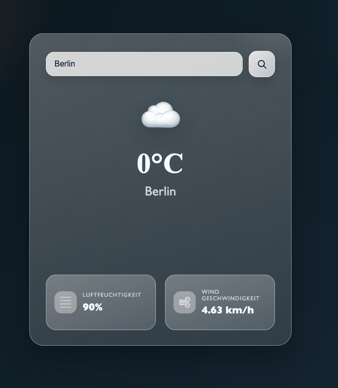

Simple weather app with **JavaScript** using the **OpenWeatherMap API**.

## Preview

## Features
- Search by city
- Shows:
  - Temperature (°C)
  - Humidity (%)
  - Wind speed (km/h)
- Weather emoji icon ☀️☁️🌧️❄️

## Tech
- HTML
- CSS
- JavaScript
- OpenWeatherMap API

## DEMO
[Weather-App](https://ismguen.github.io/weather-app/)
